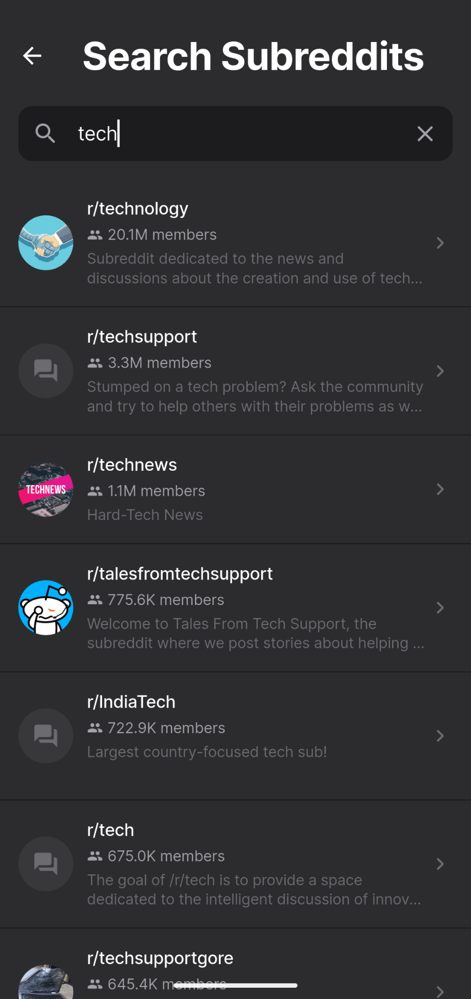
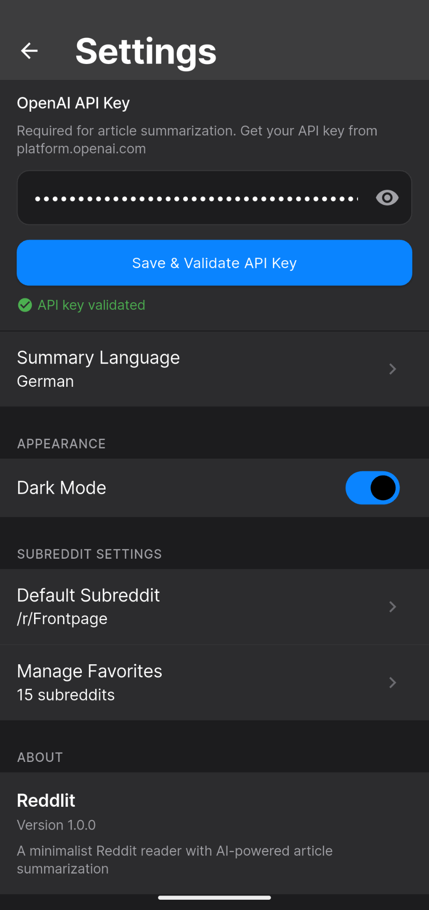

# Reddlit

A minimalist Reddit reader with AI-powered article summarization (optional). Written over a weekend with Claude Code. Share, fork, use.

Pure lurking, no account / official API support.

Targets Android. The Dart code is platform-agnostic — if you want iOS / macOS / Linux / Windows / Web, run `flutter create .` in the repo root to regenerate the platform folders and go from there.

## Features

- **Full Media Support** - Images, galleries, Reddit videos, YouTube embeds
- **AI Article Summaries** - One-tap summarization of external articles via OpenAI
- **Nested Comments** - Collapsible threads with visual depth indicators
- **Favorites & Personalization** - Save subreddits, set defaults, dark mode
- **No Account Required** - Uses Reddit's public API

## Screenshots

<p align="center">
  
  
  
</p>

## Download

Get the latest APK from [Releases](../../releases).

## Build from Source

Requires Flutter 3.9.2+

```bash
git clone https://github.com/yourusername/reddlit.git
cd reddlit
flutter pub get
flutter build apk --release
```

APK will be at `build/app/outputs/flutter-apk/app-release.apk`

## Configuration

For AI article summarization:

1. Get an API key from [OpenAI](https://platform.openai.com)
2. Open Settings in the app
3. Enter your API key

Your key is stored locally and never leaves your device except to call OpenAI.

## Tech Stack

- Flutter/Dart
- Provider (state management)
- Reddit JSON API (no auth)
- OpenAI API (summarization)

## License

MIT
